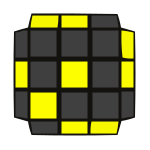
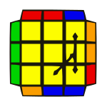
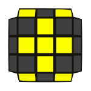
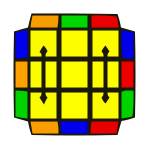

# Cycles

| Step 1                                                                                                                                   | Step 2                                                                                                                            | Step 3                                                                                                                                                |
| ---------------------------------------------------------------------------------------------------------------------------------------- | --------------------------------------------------------------------------------------------------------------------------------- | ----------------------------------------------------------------------------------------------------------------------------------------------------- |
| 
OLL 1
 

 
(R U2 R') (R' F R F') U2 (R' F R F')
     | 
OLL 2
 

 
(r U r' U2) (r U2 R' U2) (R U' r')
 | 
PLL Aa
 

 
x L2 D2 (L' U' L) D2 (L' U L')
                     |
| 
OLL 2
 

 
(r U r' U2) (r U2 R' U2) (R U' r')
        | 
OLL 2
 

 
(r U r' U2) (r U2 R' U2) (R U' r')
 | 
                                                                                                                |
| 
OLL 3
 

 
r' (R2 U R' U) (r U2 r' U) M'                      | 
OLL 4
 

 
M (U' r U2 r') (U' R U' R') M'              | 
                                                                                                                |
| 
OLL 5
 

 
(l' U2 L U) (L' U l)                               | 
OLL 8
 

 
(l' U' L U') (L' U2 l)                      | 
                                                                                                                |
| 
OLL 6
 

 
(r U2 R' U') (R U' r')                             | 
OLL 7
 

 
(r U R' U) (R U2 r')                        | 
                                                                                                                |
| 
OLL 9
 

 
(R U R' U') R' F (R2 U R' U') F'                   | 
OLL 13
 

 
F (U R U' R2) F' (R U R U') R'            | 
                                                                                                                |
| 
OLL 10
 

 
(R U R' U) (R' F R F') (R U2 R')                 | 
OLL 8
 

 
(l' U' L U') (L' U2 l)                      | 
PLL Y
 

 
F (R U' R' U') (R U R') F' (R U R' U') (R' F R F')
  |
| 
OLL 11
 

 
(r U R' U) (R' F R F') (R U2 r')                 | 
OLL 6
 

 
(r U2 R' U') (R U' r')                      | 
PLL V
 

 
(R' U R' U') y R' F' (R2 U' R' U) R' F R F
          |
| 
OLL 12
 

 
M' (R' U' R U') (R' U2 R U') R r'                | 
OLL 5
 

 
(l' U2 L U) (L' U l)                        | 
PLL Z
 

 
M' U M2 U M2 U M' U2 M2
                             |
| 
OLL 14
 

 
R' F (R U R') F' R F U' F'                       | 
OLL 10
 

 
(R U R' U) (R' F R F') (R U2 R')          | 
PLL Jb
 

 
(R U R') F' (R U R' U') R' F (R2 U' R')
            |
| 
OLL 15
 

 
(l' U' l) (L' U' L U) (l' U l)                   | 
OLL 8
 

 
(l' U' L U') (L' U2 l)                      | 
PLL Ua
 

 
M2 U M U2 M' U M2
                                 |
| 
OLL 16
 

 
(r U r') (R U R' U') (r U' r')                   | 
OLL 7
 

 
(r U R' U) (R U2 r')                        | 
PLL Ub
 

 
M2 U' M U2 M' U' M2
                               |
| 
OLL 17
 

 
F R' F' R2 (r' U R U') R' U' M'                  | 
OLL 19
 

 
r' (R U R U) R' U' M' (R' F R F')         | 
 
                                                                                                      |
| 
OLL 18
 

 
(r U R' U) (R U2 r') (r' U' R U') (R' U2 r)      | 
OLL 19
 

 
r' (R U R U) R' U' M' (R' F R F')         | 
PLL F
 

 
R' U' F' (R U R' U') R' F (R2 U' R' U') (R U R' U) R
 |
| 
OLL 20
 

 
(r U R' U') M2 (U R U' R') U' M'                 | 
OLL 20
 

 
(r U R' U') M2 (U R U' R') U' M'          | 
                                                                                                                |
| 
OLL 21
 

 
(R U2 R' U') (R U R' U') (R U' R')               | 
OLL 21
 

 
(R U2 R' U') (R U R' U') (R U' R')        | 
PLL H
 

 
M2 U M2 U2 M2 U M2
                                  |
| 
OLL 22
 

 
R U2 (R2 U' R2 U' R2) U2 R                       | 
OLL 22
 

 
R U2 (R2 U' R2 U' R2) U2 R                | 
PLL Ua
 

 
M2 U M U2 M' U M2
                                 |
| 
OLL 23
 

 
R2 D' (R U2 R') D (R U2 R)
             | 
OLL 25
 

 
F' (r U R' U') r' F R
            | 
PLL Aa
 

 
x L2 D2 (L' U' L) D2 (L' U L')
                     |
| 
OLL 24
 

 
(r U R' U') (r' F R F')
                | 
OLL 25
 

 
F' (r U R' U') r' F R
            | 
PLL Ab
 

 
x' L2 D2 (L U L') D2 (L U' L)
                      |
| 
OLL 25
 

 
F' (r U R' U') r' F R
                  | 
OLL 24
 

 
(r U R' U') (r' F R F')
          | 
PLL E
 

 
x' (L' U L) D' (L' U' L) D (L' U' L) D' (L' U L) D
  |
| 
OLL 26
 

 
(R U2 R') (U' R U' R')                           | 
OLL 27
 

 
(R U R' U) (R U2 R')                      | 
 
  
                                                                                            |
| 
OLL 28
 

 
(r U R' U') r' (R U R U') R'                     | 
OLL 57
 

 
(R U R' U') M' (U R U' r')                | 
 
  
                                                                                            |
| 
OLL 29
 

 
(R U R' U') (R U' R') F' U' F (R U R')
 | 
OLL 44
 

 
F (U R U' R') F'
                 | 
PLL Rb
 

 
R2 F (R U R U') R' F' (R U2 R' U2) R
              |
| 
OLL 30
 

 
F R' F (R2 U' R' U') (R U R') F2
       | 
OLL 45
 

 
F (R U R' U') F'
                 | 
PLL Y
 

 
F (R U' R' U') (R U R') F' (R U R' U') (R' F R F')
  |
| 
OLL 31
 

 
R' U' F (U R U' R') F' R                         | 
OLL 40
 

 
R' F (R U R' U') F' U R                   | 
 
  
                                                                                            |
| 
OLL 32
 

 
L U F' (U' L' U L) F L'                          | 
OLL 39
 

 
L F' (L' U' L U) F U' L'                  | 
 
  
                                                                                            |
| 
OLL 33
 

 
(R U R' U') (R' F R F')                          | 
OLL 37
 

 
(F R' F' R) (U R U' R')                   | 
 
  
                                                                                            |
| 
OLL 34
 

 
R U (R2 U' R') F (R U R U') F'
         | 
OLL 37
 

 
(F R' F' R) (U R U' R')
          | 
PLL Aa
 

 
x L2 D2 (L' U' L) D2 (L' U L')
                     |
| 
OLL 35
 

 
(R U2 R') (R' F R F') (R U2 R')
        | 
OLL 37
 

 
(F R' F' R) (U R U' R')
          | 
PLL Ra
 

 
(R U' R' U') (R U R) D (R' U' R) D' (R' U2 R')
    |
| 
OLL 36
 

 
(L' U' L U') (L' U L U) (L F' L' F)
    | 
OLL 32
 

 
L U F' (U' L' U L) F L'
          | 
PLL Y
 

 
F (R U' R' U') (R U R') F' (R U R' U') (R' F R F')
  |
| 
OLL 38
 

 
(R U R' U) (R U' R' U') (R' F R F')
    | 
OLL 31
 

 
R' U' F (U R U' R') F' R
         | 
PLL Y
 

 
F (R U' R' U') (R U R') F' (R U R' U') (R' F R F')
  |
| 
OLL 41
 

 
(R U R' U) (R U2 R') F (R U R' U') F'            | 
OLL 43
 

 
F' (U' L' U L) F                          | 
PLL Ua
 

 
M2 U M U2 M' U M2
                                 |
| 
OLL 42
 

 
(R' U' R U') (R' U2 R) F (R U R' U') F'          | 
OLL 41
 

 
(R U R' U) (R U2 R') F (R U R' U') F'     | 
PLL Ua
 

 
M2 U M U2 M' U M2
                                 |
| 
OLL 43
 

 
F' (U' L' U L) F                                 | 
OLL 45
 

 
F (R U R' U') F'                          | 
PLL Ua
 

 
M2 U M U2 M' U M2
                                 |
| 
OLL 44
 

 
F (U R U' R') F'                                 | 
OLL 45
 

 
F (R U R' U') F'                          | 
 
  
                                                                                            |
| 
OLL 46
 

 
R' U' (R' F R F') U R                            | 
OLL 43
 

 
F' (U' L' U L) F                          | 
PLL Z
 

 
M' U M2 U M2 U M' U2 M2
                             |
| 
OLL 47
 

 
R' U' (R' F R F') (R' F R F') U R                | 
OLL 52
 

 
(R U R' U) R U' B U' B' R'                | 
PLL V
 

 
(R' U R' U') y R' F' (R2 U' R' U) R' F R F
          |
| 
OLL 48
 

 
F (R U R' U') (R U R' U') F'                     | 
OLL 51
 

 
F (U R U' R') (U R U' R') F'              | 
 
  
                                                                                            |
| 
OLL 49
 

 
r U' r2 U r2 U (r2 U' r)                         | 
OLL 50
 

 
r' U r2 U' r2 U' (r2 U r') F'             | 
 
  
                                                                                            |
| 
OLL 52
 

 
(R U R' U) R U' B U' B' R'                       | 
OLL 52
 

 
(R U R' U) R U' B U' B' R'                | 
                                                                                                                |
| 
OLL 53
 

 
(l' U2 L U) (L' U' L U) (L' U l)                 | 
OLL 53
 

 
(l' U2 L U) (L' U' L U) (L' U l)          | 
PLL H
 

 
M2 U M2 U2 M2 U M2
                                  |
| 
OLL 54
 

 
(r U2 R' U') (R U R' U') (R U' r')               | 
OLL 54
 

 
(r U2 R' U') (R U R' U') (R U' r')        | 
PLL H
 

 
M2 U M2 U2 M2 U M2
                                  |
| 
OLL 55
 

 
R' F (R U R U') R2 F' (R2 U' R' U) (R U R')      | 
OLL 54
 

 
(r U2 R' U') (R U R' U') (R U' r')        | 
PLL Ua
 

 
M2 U M U2 M' U M2
                                 |
| 
OLL 56
 

 
(r' U' r) (U' R' U R) (U' R' U R) (r' U r)       | 
OLL 53
 

 
(l' U2 L U) (L' U' L U) (L' U l)          | 
PLL Ua
 

 
M2 U M U2 M' U M2
                                 |
